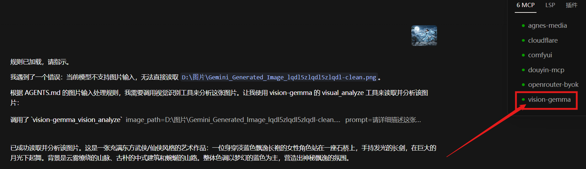
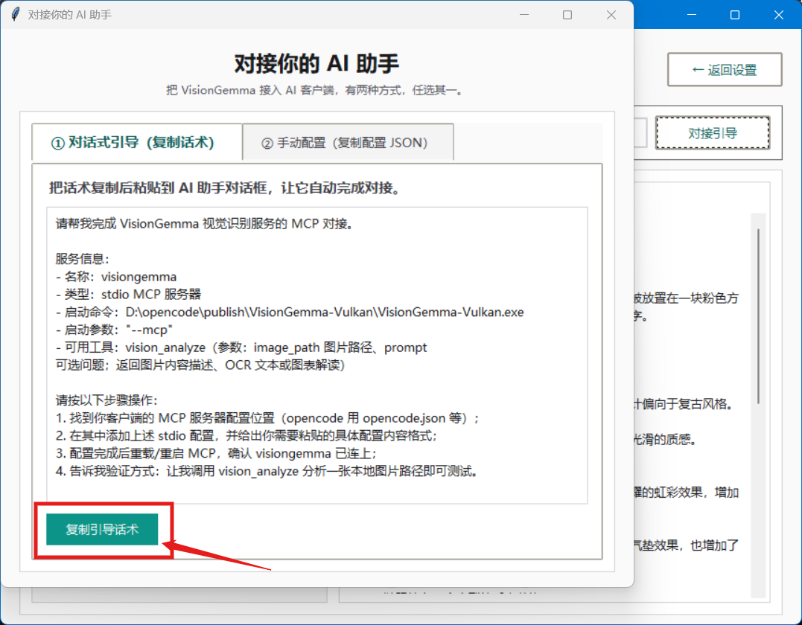
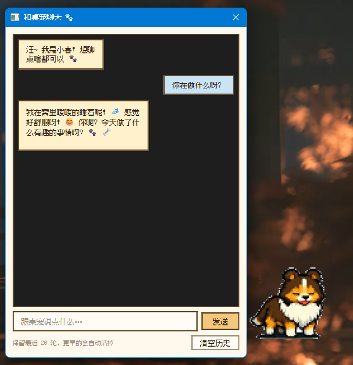

# VisionGemma - 本地图片识别 + AI 桌宠

在完全本地的 Windows 电脑上运行的开箱即用图片识别工具 + 趣味 AI 桌宠。**图片识别全程在本机完成，不上传任何数据**。

## 产品展示

### 🤖 Agent 自动调起识别

当你的 AI 助手遇到图片、又恰好不支持图片输入时，VisionGemma 会作为 MCP 工具被自动调起，把"看图能力"无缝交给它：

### 🔌 一键接入你的 AI 助手

不用手写配置文件。软件内置对接引导，复制一段话粘贴给 AI 助手，或直接复制配置 JSON，即可完成 MCP 对接：

### 🖼️ 本地精准识别

选图 → 识别 → 得到结构化描述，全程离线。产品图、截图、图表都能看懂：

### 🐾 趣味 AI 桌宠

桌面陪伴小宠物，支持自然对话、识别屏幕与图片：

## 功能特性

- **傻瓜式部署**：下载解压，双击运行，自动下载模型并完成配置，零命令行、零环境配置
- **Agent MCP 对接**：可作为 MCP 服务器接入任意 AI 工具（\ision_analyze\ 工具），让 AI 获得看图能力
- **本地图片识别**：图片分析、OCR 文字提取、图表解读、场景描述全部在本机完成
- **Vulkan 加速**：支持 NVIDIA / AMD / Intel 显卡硬件加速；无独显时自动回退 CPU 运行
- **趣味 AI 桌宠**：托盘启动可爱桌宠，可对话、可识别屏幕/图片，互动陪伴
- **隐私安全**：所有识别完全离线本地完成，不上传任何数据到云端
- **单文件免安装**：一个 exe 即完整运行，内置 Vulkan 引擎与桌宠

## 系统要求

- Windows 10/11 x64
- 显卡支持 Vulkan（NVIDIA / AMD / Intel 均可，推荐硬件加速）
- 无独显时自动回退 CPU 运行
- 磁盘剩余空间 >= 5GB（模型约 3.2GB）

## 下载

### GitHub Release（推荐）

[前往 Releases 页面下载 v1.0.0](https://github.com/q1023884985/visiongemma/releases)

> 安装包：VisionGemma-Vulkan.zip
> SHA256：\1DC26CB187923764C4CA03A8A852493081D123C9680B803FAE73CF560B640967
### 夸克网盘镜像（国内用户加速）

[夸克网盘下载 VisionGemma-Vulkan.zip](https://pan.quark.cn/s/0137ca6fb214)

## 快速开始

1. 解压压缩包，双击 VisionGemma-Vulkan.exe，首次运行自动打开配置向导
2. 向导引导自动下载模型（约 3.2GB，支持断点续传）
3. 下载完成后即可开始使用

## 趣味桌宠

1. 右键托盘图标 →「趣味桌宠」，可快速启动桌宠，自动拉起本地识别引擎
2. 桌宠支持对话、选择主题等功能
3. 可通过托盘菜单设置开机自启

## 作为 MCP 服务器使用（接入 AI 工具）

在 AI 工具的 MCP 配置中加入：

\\\\\json
{
  "mcpServers": {
    "vision-gemma": {
      "command": "VisionGemma-Vulkan.exe 完整路径",
      "args": ["--mcp"],
      "type": "stdio"
    }
  }
}
\\\\
然后即可调用 \ision_analyze\ 工具识别图片。更省事的做法：打开软件的「对接引导」，复制话术粘贴给 AI 助手即可。

## 文件说明

- VisionGemma-Vulkan.exe 主程序（内置 Vulkan 引擎 + 桌宠，单文件免安装）
- 模型存放于 %LOCALAPPDATA%\VisionGemma\models

## 隐私说明

所有图片识别完全在本地完成，**不上传任何数据**。

## 售后支持

- QQ：1023884985
- 微信：13147295520
- 邮箱：1023884985@qq.com

## 友情链接

- [爱AI工具库](https://www.2ai.cn/)
- [doforai - 发现最佳人工智能工具](https://doforai.tools/)
